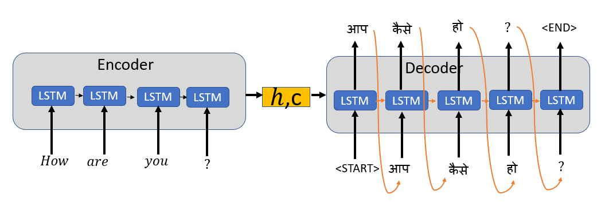

# Seq2Seq Neural Machine Translation (NMT) Model

This repository contains an implementation of a **Sequence-to-Sequence Neural Machine Translation (NMT) model** using PyTorch. The model leverages an encoder-decoder architecture with attention, bidirectional LSTMs, and word embeddings to translate sentences between Cherokee and English.

The repository provides scripts for training, evaluating, and decoding sentences, making it suitable for language translation tasks.

---

## What This Repository Does

1. **Neural Machine Translation**: Implements a Sequence-to-Sequence (Seq2Seq) model with attention mechanisms for language translation.

2. **Encoder-Decoder Architecture**:
   - **Encoder**: A bidirectional LSTM processes source language sentences into a context vector.
   - **Decoder**: An LSTM decoder generates the target sentence, incorporating attention at each step.

3. **Attention Mechanism**: Uses the Luong-style global attention for aligning source and target tokens.

4. **Training and Evaluation**: Provides functionality to train the model with cross-entropy loss and evaluate performance using perplexity and BLEU scores.

5. **Beam Search Decoding**: Enables efficient generation of translations during inference.

<p align="center">
  
</p>

The image illustrates the Seq2Seq model’s Encoder-Decoder architecture, showing how the encoder processes the input sentence into context vectors (h, c), while the decoder generates the output sentence step-by-step using attention mechanisms. It visualizes the flow from input tokens to output tokens with attention-based alignment, exemplifying the neural machine translation process.

## Installation

### Using Conda
This package is distributed with a Conda environment. To install:

```bash
conda env create -f environment.yml
conda activate nmt
```

For GPU support, use the CUDA environment:

```bash
conda env create -f environment.yml
conda activate nmt_cuda
```

## How to Run the Code

## Step 1: Prepare Your Dataset

Ensure the datasets are located in the `chr_en_data/` directory.

## Step 2: Train the Model

Run the following command to train the NMT model:

```bash
python run.py train --train-src chr_en_data/train.chr --train-tgt chr_en_data/train.en --dev-src chr_en_data/dev.chr --dev-tgt chr_en_data/dev.en --vocab vocab.json --save-to model.bin
```

### Example (using GPU):

```bash
python run.py train --train-src chr_en_data/train.chr --train-tgt chr_en_data/train.en --dev-src chr_en_data/dev.chr --dev-tgt chr_en_data/dev.en --vocab vocab.json --save-to model.bin --gpu
```

## Step 3: Evaluate the Model

The script automatically evaluates the model on the development dataset during training. The perplexity and BLEU score are displayed in the terminal.

## Step 4: Decode New Sentences

Translate sentences from the test set using the trained model:

```bash
python run.py decode model.bin chr_en_data/test.chr chr_en_data/test.en output.txt --gpu
```

This will write the translations to output.txt and display the BLEU score for the test set.

### Key Parameters

| **Parameter**      | **Description**                                   | **Default** |
|---------------------|---------------------------------------------------|-------------|
| `--train-src`       | Path to the training source file.                 | `None`      |
| `--train-tgt`       | Path to the training target file.                 | `None`      |
| `--dev-src`         | Path to the development source file.              | `None`      |
| `--dev-tgt`         | Path to the development target file.              | `None`      |
| `--vocab`           | Path to the vocabulary file.                      | `None`      |
| `--save-to`         | Path to save the trained model.                   | `model.bin` |
| `--embed-size`      | Embedding size for word embeddings.               | `256`       |
| `--hidden-size`     | Hidden size for LSTM layers.                      | `256`       |
| `--batch-size`      | Batch size for training.                          | `32`        |
| `--max-epoch`       | Maximum number of training epochs.                | `30`        |
| `--dropout`         | Dropout rate for regularization.                  | `0.3`       |
| `--beam-size`       | Beam size for decoding.                           | `5`         |
| `--gpu`             | Use GPU for computation.                          | `False`     |

## Acknowledgments

This project was inspired by [Natural Language Processing with Deep Learning](https://online.stanford.edu/courses/xcs224n-natural-language-processing-deep-learning) course provided by Stanford University.

## License

This project is licensed under the MIT License. See the LICENSE file for details.

## Contacts

- LinkedIn: [Enrico Zanetti](https://www.linkedin.com/in/enrico-zanetti/)
